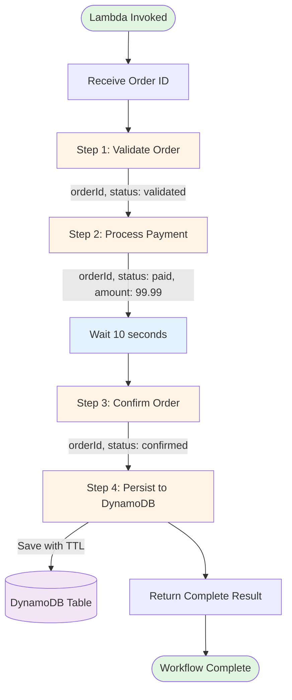

# Durable Functions Integration Testing

This sample demonstrates how to write integration tests for AWS Durable Functions using the AWS Durable Execution SDK for Python. Durable Functions allow you to write stateful, long-running workflows as code that can survive failures and restarts.

## Overview

This pattern shows how to test durable functions that are deployed to AWS. The tests use the `DurableFunctionCloudTestRunner` to invoke deployed durable functions and verify their behavior, including:

- Successful workflow execution
- Error handling and failure scenarios
- Performance and timing validation
- State persistence across retries

## What are Durable Functions?

Durable Functions enable you to write stateful workflows in code. They provide:

- **Automatic state persistence**: Function state is automatically saved and restored
- **Fault tolerance**: Workflows can survive failures and continue from where they left off
- **Long-running operations**: Support for workflows that take minutes, hours, or days
- **Built-in retry logic**: Automatic retries with exponential backoff
- **Activity functions**: Break complex workflows into smaller, testable units

## System Under Test

The example implements an order processing workflow with the following steps:

1. **Validate Order**: Checks if the order is valid
2. **Process Payment**: Simulates payment processing
3. **Wait**: 10-second delay to simulate external confirmation
4. **Confirm Order**: Sends order confirmation
5. **Persist to DynamoDB**: Saves the completed order to DynamoDB with TTL

The workflow uses durable execution to ensure that even if the Lambda function times out or fails, the workflow can resume from the last completed step. The final step persists the order data to DynamoDB for audit and retrieval purposes.



## Prerequisites

- SAM CLI - [Install the SAM CLI](https://docs.aws.amazon.com/serverless-application-model/latest/developerguide/serverless-sam-cli-install.html)
- Python 3.13 or later - [Install Python 3](https://www.python.org/downloads/)
- AWS Durable Execution SDK for Python - Installed via requirements.txt

## Project Structure

```
durable-functions-integration/
├── src/
│   └── order_processor/          # Main durable function
│       ├── app.py                # Workflow orchestration
│       └── requirements.txt      # Function dependencies
├── tests/
│   ├── integration/
│   │   └── test_order_processor.py  # Integration tests
│   └── requirements.txt          # Test dependencies
├── template.yaml                 # SAM template
├── pytest.ini                    # Pytest configuration
└── README.md                     # This file
```

## Build and Deploy

### Install dependencies

1. Navigate to the project directory:
```bash
cd python-test-samples/durable-functions-integration
```

2. Create a virtual environment (optional but recommended):
```bash
python3 -m venv .venv
source .venv/bin/activate  # On Windows: .venv/Scripts/activate
pip install -r tests/requirements.txt
```

### Build the project
```bash
sam build
```

### Deploy to AWS

First deployment (guided):
```bash
sam deploy
```

## Run Integration Tests

The integration tests run against the deployed durable function in AWS.

Run the integration tests using pytest:

```bash
python3 -m pytest tests/integration/test_order_processor.py -v -s
```

Or run all tests in the integration directory:

```bash
pytest tests/integration/ -v -s
```

**Flags:**
- `-v` : Verbose output showing each test
- `-s` : Show print statements and logging output

### Test Coverage

The integration tests cover:

1. **Successful Workflow Execution** (`test_cloud_order_processor_success`)
   - Verifies the complete workflow executes successfully
   - Validates all steps complete in the correct order
   - Checks the final output structure
   - Confirms persistence result is included in response

2. **Error Handling** (`test_cloud_order_processor_with_invalid_input`)
   - Tests workflow behavior with invalid input
   - Verifies proper error propagation
   - Ensures graceful failure handling

3. **Performance Testing** (`test_cloud_performance`)
   - Measures real-world execution time
   - Validates timing expectations (10-second wait + overhead)
   - Ensures workflows complete within acceptable timeframes

4. **DynamoDB Persistence** (`test_dynamodb_persistence`)
   - Verifies orders are saved to DynamoDB
   - Validates all order fields are persisted correctly
   - Confirms TTL and metadata are set properly
   - Checks data type conversions (Decimal for amounts)


## Architecture

The sample includes:

- **Lambda Function**: Durable function with 5 workflow steps
- **DynamoDB Table**: Stores completed orders with 30-day TTL
- **IAM Policies**: Durable execution policy + DynamoDB CRUD permissions

## Cleanup

Remove local build artifacts:
```bash
rm -rf .aws-sam
rm -rf .venv
rm -rf .pytest_cache
rm -rf samconfig.toml
```

Delete the CloudFormation stack (this will also delete the DynamoDB table):
```bash
sam delete --stack-name {stack_name}
```

## Additional Resources

- [AWS Durable Execution Documentation](https://docs.aws.amazon.com/lambda/latest/dg/durable-execution.html)
- [AWS Durable Execution SDK for Python](https://github.com/awslabs/aws-durable-execution-sdk-python)
- [Serverless Testing Best Practices](../../Serverless-Testing-Principles.md)

## License

This sample is licensed under the MIT-0 License. See the LICENSE file.
